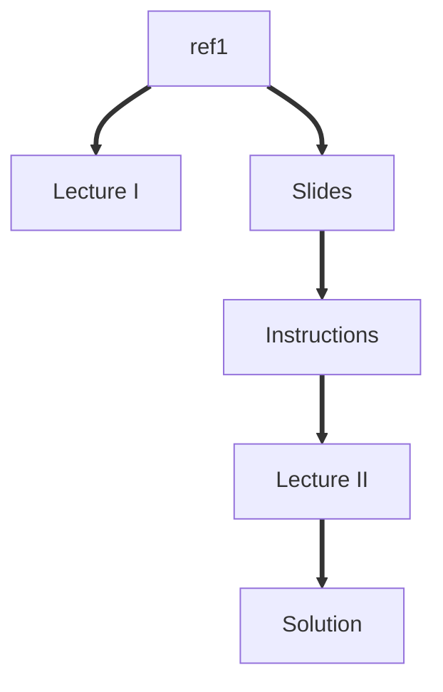

# Masterclass 22.11: Variationally Enhanced Sampling

This lesson was given as part of the PLUMED masterclass series in 2022.  It includes:

* A video lecture that explain the theory covered (Lecture 1).
* The lecture slides covered in Lecture 1. 
* A series of exercises that you should try to complete yourself.
* A Video lecture going over how the exercises should be completed (Lecture 2).
* A python notebook with the solution that was used in Lecture 2.

The flow chart shown below indicates the order in which you should consult the resources.  You can click on the nodes to access the various resources.  Follow the thick black lines for the best results.  The resources that are connected by dashed lines are supplementary resources that you may find useful when completing the exercise.

